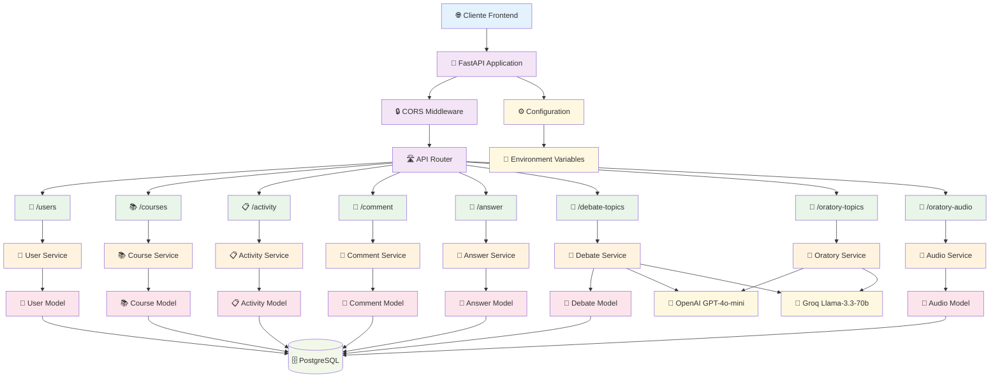
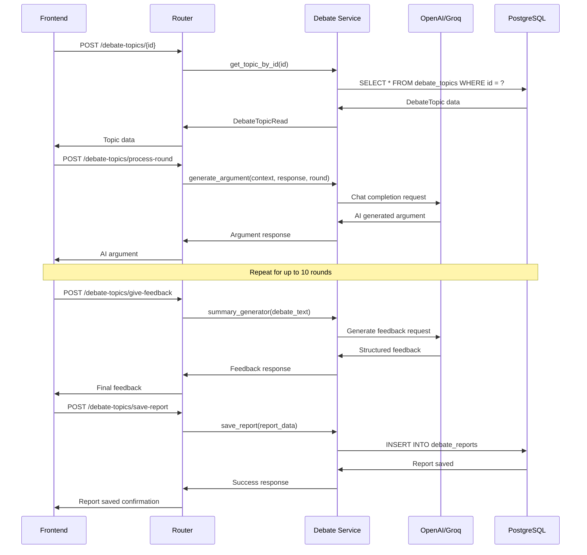
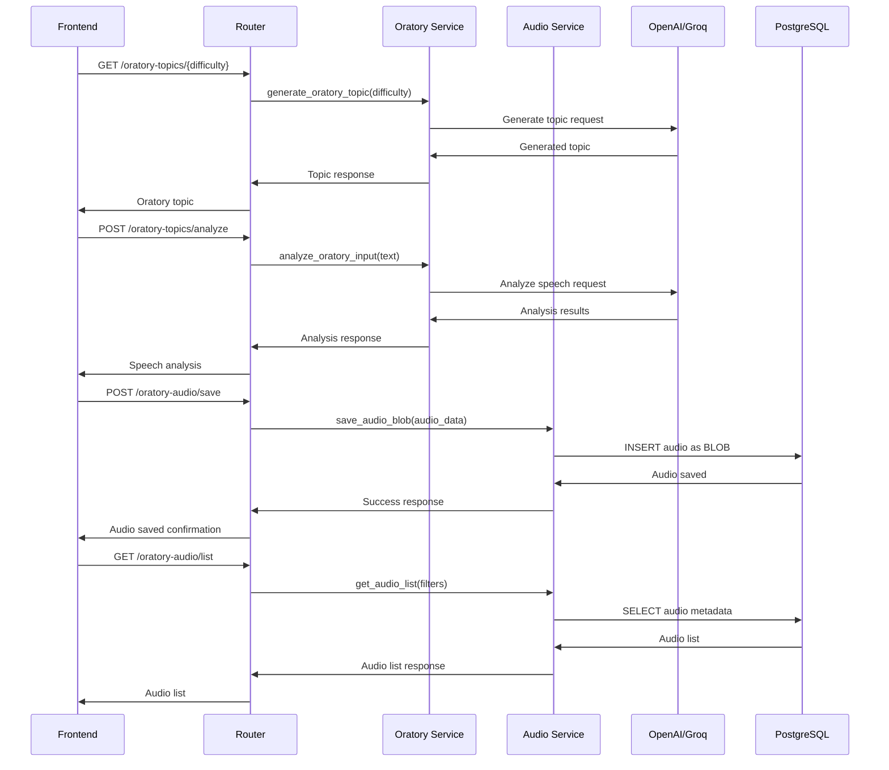
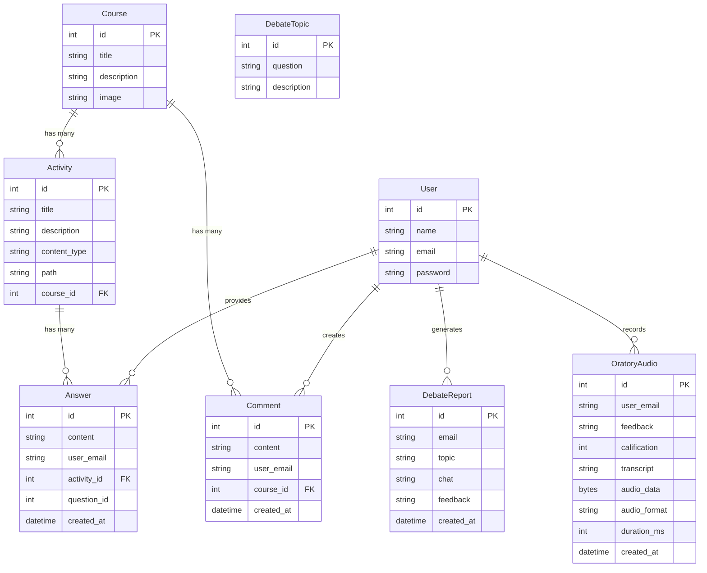
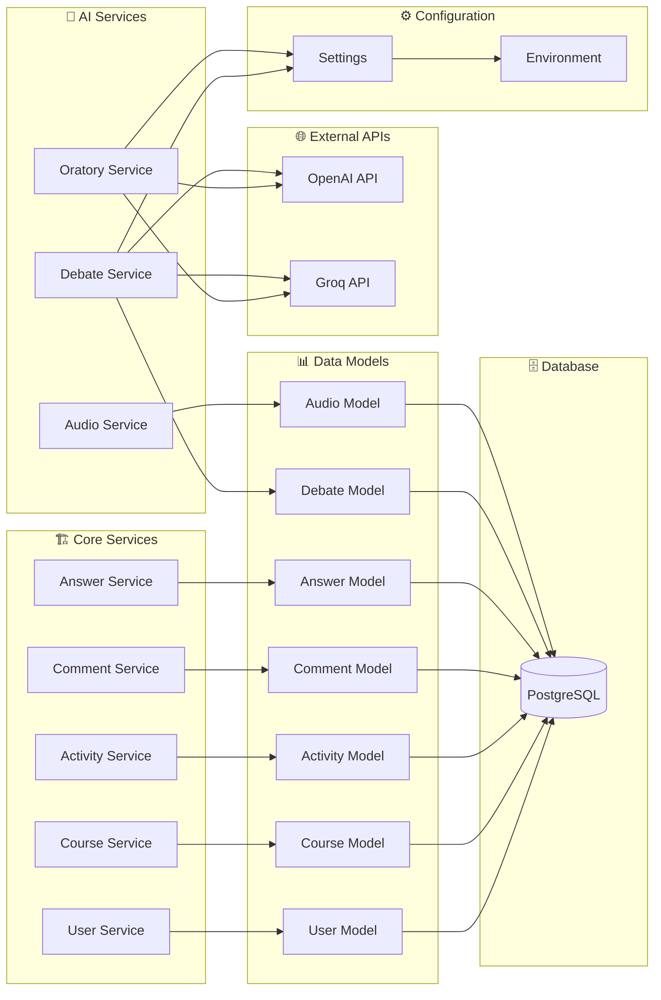
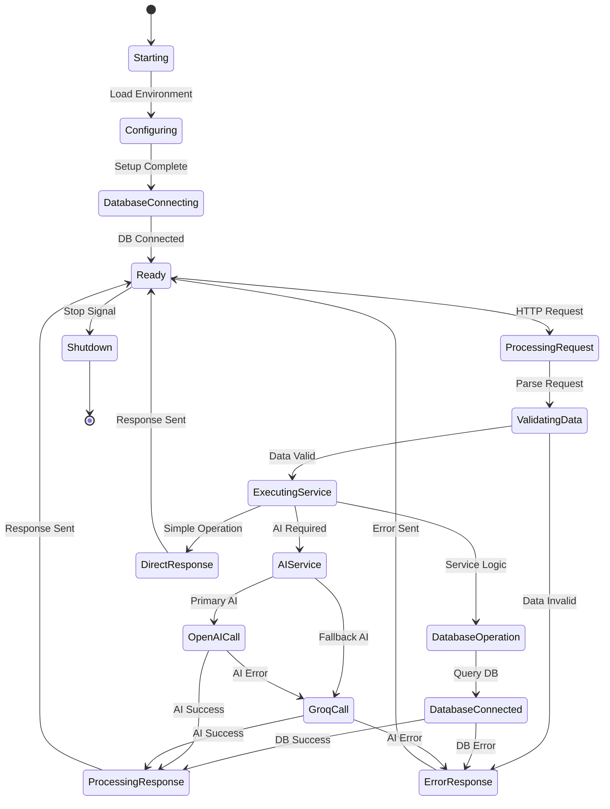
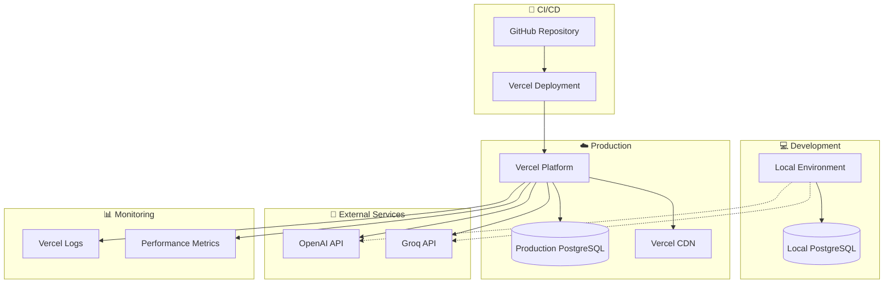

# Diagrama de Arquitectura Backend - Código Mermaid

## Diagrama Principal de Arquitectura



## Diagrama de Flujo de Datos - Pensamiento Crítico



## Diagrama de Flujo de Datos - Oratoria



## Diagrama de Modelos de Datos



## Diagrama de Servicios y Dependencias



## Diagrama de Estados del Sistema



## Diagrama de Deployment



## Uso de los Diagramas

### Para incluir en LaTeX:
1. Copia cada código Mermaid
2. Genera las imágenes en [mermaid.live](https://mermaid.live)
3. Exporta como PNG/SVG de alta calidad
4. Incluye en tu documento

### Ejemplo de inclusión:
```latex
\begin{figure}[h]
    \centering
    \includegraphics[width=\textwidth]{diagrama-arquitectura-backend.png}
    \caption{Arquitectura Backend con FastAPI y PostgreSQL}
    \label{fig:backend-architecture}
\end{figure}
```

### Diagramas recomendados para el Anexo C:
1. **Diagrama Principal** - Vista general de la arquitectura
2. **Diagrama de Modelos** - Estructura de la base de datos
3. **Diagrama de Servicios** - Organización de servicios y dependencias
4. **Diagrama de Deployment** - Configuración de producción 