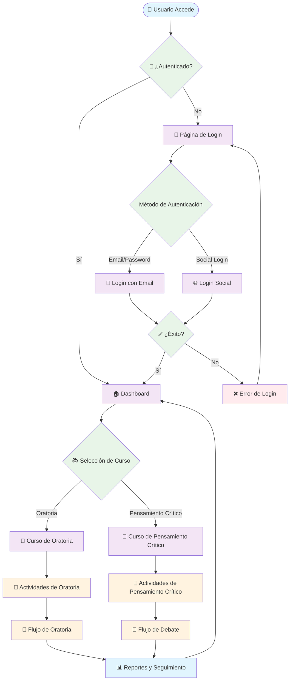
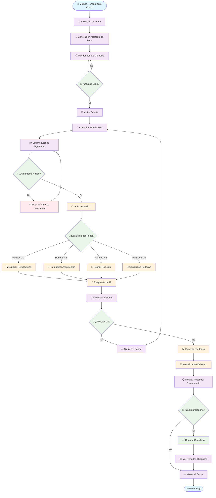
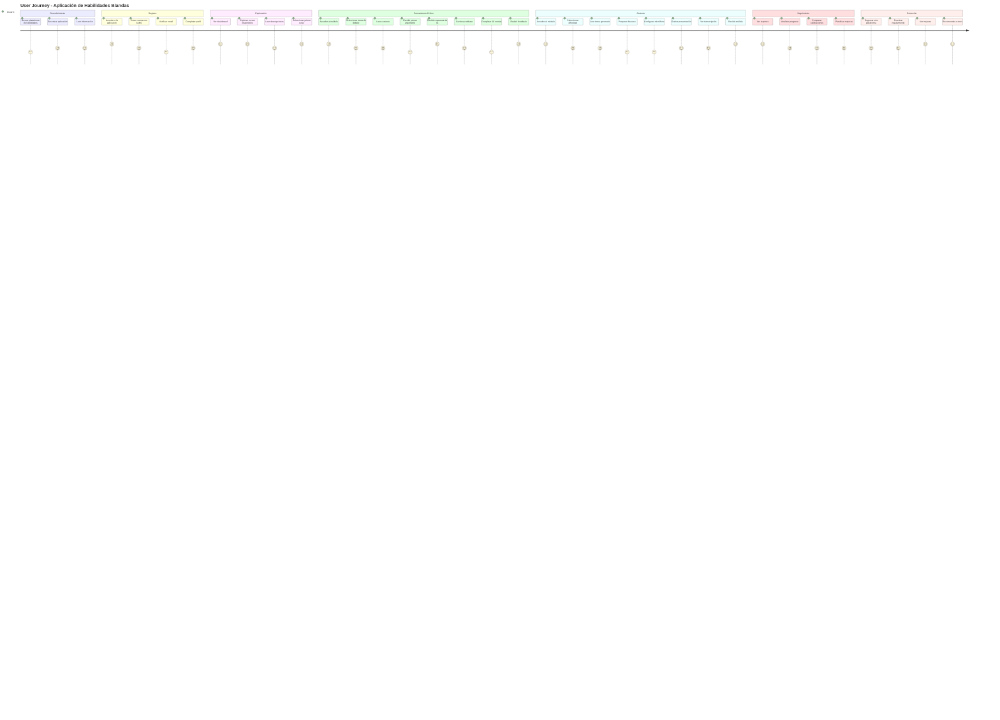
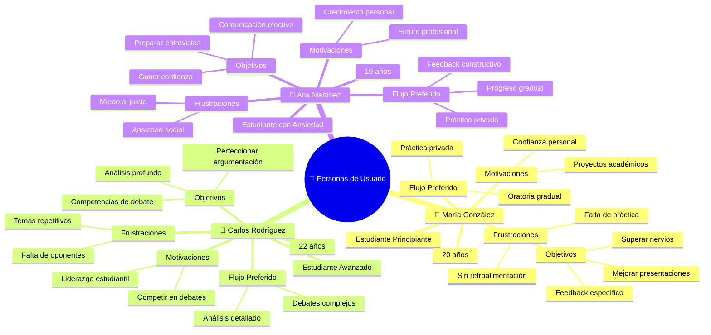
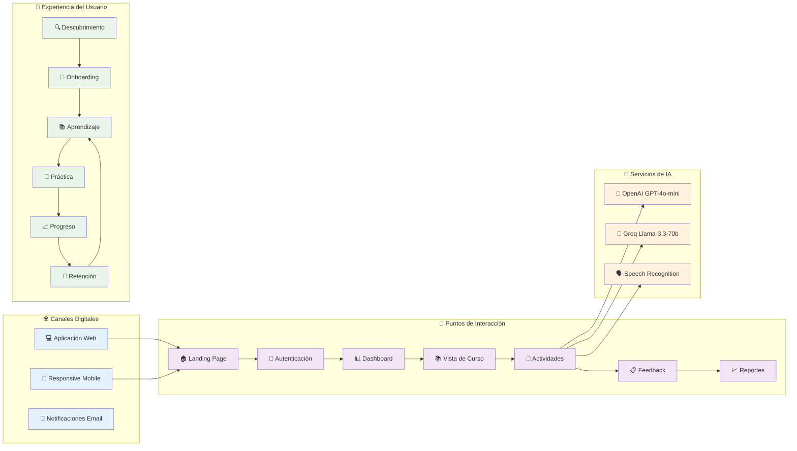

# Diagramas de Flujos de Usuario - Código Mermaid

## Diagrama de Flujo Principal de Usuario



## Diagrama de Flujo de Pensamiento Crítico



## Diagrama de Flujo de Oratoria

```mermaid
flowchart TD
    Start([🎤 Módulo de Oratoria]) --> DifficultySelection[🎯 Seleccionar Dificultad]
    
    DifficultySelection --> DifficultyLevel{📊 Nivel de Dificultad}
    DifficultyLevel -->|1-2| BeginnerTopic[🌱 Tema Principiante]
    DifficultyLevel -->|3| IntermediateTopic[🌿 Tema Intermedio]
    DifficultyLevel -->|4-5| AdvancedTopic[🌳 Tema Avanzado]
    
    BeginnerTopic --> TopicGeneration[🤖 IA Genera Tema]
    IntermediateTopic --> TopicGeneration
    AdvancedTopic --> TopicGeneration
    
    TopicGeneration --> TopicDisplay[📋 Mostrar Tema Generado]
    TopicDisplay --> PreparationTime[⏰ Tiempo de Preparación]
    
    PreparationTime --> UserReady{👤 ¿Listo para Grabar?}
    UserReady -->|No| PreparationTime
    UserReady -->|Sí| MicPermission[🎙️ Solicitar Permisos de Micrófono]
    
    MicPermission --> PermissionCheck{✅ ¿Permisos Otorgados?}
    PermissionCheck -->|No| PermissionError[❌ Error: Permisos Requeridos]
    PermissionCheck -->|Sí| AudioSetup[🔧 Configuración de Audio]
    
    PermissionError --> MicPermission
    
    AudioSetup --> AudioTest[🎵 Prueba de Calidad de Audio]
    AudioTest --> QualityCheck{🔍 ¿Calidad Adecuada?}
    
    QualityCheck -->|No| AudioAdjust[⚙️ Ajustar Configuración]
    QualityCheck -->|Sí| RecordingStart[🔴 Iniciar Grabación]
    
    AudioAdjust --> AudioTest
    
    RecordingStart --> Recording[🎙️ Grabando...]
    Recording --> SpeechRecognition[🗣️ Speech Recognition API]
    
    SpeechRecognition --> RealTimeTranscript[📝 Transcripción en Tiempo Real]
    RealTimeTranscript --> RecordingActive{🔴 ¿Grabación Activa?}
    
    RecordingActive -->|Sí| Recording
    RecordingActive -->|No| StopRecording[⏹️ Detener Grabación]
    
    StopRecording --> AudioProcessing[🔄 Procesando Audio...]
    AudioProcessing --> TranscriptAnalysis[📊 Análisis de Transcripción]
    
    TranscriptAnalysis --> AIAnalysis[🤖 IA Analizando Discurso...]
    AIAnalysis --> AnalysisAspects{🎯 Aspectos de Análisis}
    
    AnalysisAspects --> FluencyAnalysis[🌊 Análisis de Fluidez]
    AnalysisAspects --> CoherenceAnalysis[🧩 Análisis de Coherencia]
    AnalysisAspects --> StructureAnalysis[🏗️ Análisis de Estructura]
    AnalysisAspects --> LanguageAnalysis[📚 Análisis de Lenguaje]
    
    FluencyAnalysis --> GenerateFeedback[📋 Generar Feedback]
    CoherenceAnalysis --> GenerateFeedback
    StructureAnalysis --> GenerateFeedback
    LanguageAnalysis --> GenerateFeedback
    
    GenerateFeedback --> ScoreCalculation[🎯 Cálculo de Calificación]
    ScoreCalculation --> FeedbackDisplay[📊 Mostrar Feedback Detallado]
    
    FeedbackDisplay --> SaveAudio{💾 ¿Guardar Audio?}
    SaveAudio -->|Sí| AudioStorage[🗄️ Guardar en Base de Datos]
    SaveAudio -->|No| ViewHistory[📈 Ver Historial]
    
    AudioStorage --> AudioSaved[✅ Audio Guardado como BLOB]
    AudioSaved --> ViewHistory
    
    ViewHistory --> ProgressMetrics[📊 Métricas de Progreso]
    ProgressMetrics --> BackToCourse[🔙 Volver al Curso]
    
    BackToCourse --> End([🏁 Fin del Flujo])
    
    %% Estilos
    classDef startEnd fill:#e1f5fe
    classDef process fill:#f3e5f5
    classDef decision fill:#e8f5e8
    classDef aiProcess fill:#fff3e0
    classDef error fill:#ffebee
    classDef success fill:#e8f5e8
    classDef recording fill:#ffecb3
    
    class Start,End startEnd
    class DifficultySelection,TopicGeneration,TopicDisplay,PreparationTime,MicPermission,AudioSetup,AudioTest,AudioAdjust,RecordingStart,StopRecording,AudioProcessing,TranscriptAnalysis,ScoreCalculation,FeedbackDisplay,ViewHistory,ProgressMetrics,BackToCourse process
    class DifficultyLevel,UserReady,PermissionCheck,QualityCheck,RecordingActive,AnalysisAspects,SaveAudio decision
    class BeginnerTopic,IntermediateTopic,AdvancedTopic,AIAnalysis,FluencyAnalysis,CoherenceAnalysis,StructureAnalysis,LanguageAnalysis,GenerateFeedback aiProcess
    class PermissionError error
    class AudioSaved success
    class Recording,SpeechRecognition,RealTimeTranscript recording
```



## Diagrama de User Journey Completo



## Diagrama de Personas de Usuario



## Diagrama de Puntos de Contacto



## Uso de los Diagramas

### Para incluir en LaTeX:
1. Copia cada código Mermaid
2. Genera las imágenes en [mermaid.live](https://mermaid.live)
3. Exporta como PNG/SVG de alta calidad
4. Incluye en tu documento

### Ejemplo de inclusión:
```latex
\begin{figure}[h]
    \centering
    \includegraphics[width=\textwidth]{diagrama-flujo-usuario-principal.png}
    \caption{Flujo Principal de Usuario en la Aplicación}
    \label{fig:user-flow-main}
\end{figure}
```

### Diagramas recomendados para el Anexo E:
1. **Flujo Principal** - Vista general de navegación
2. **Flujo de Pensamiento Crítico** - Proceso detallado del módulo de debate
3. **Flujo de Oratoria** - Proceso detallado del módulo de voz
4. **User Journey** - Experiencia completa del usuario
5. **Personas** - Perfiles de usuarios objetivo
6. **Puntos de Contacto** - Mapa de interacciones del sistema 