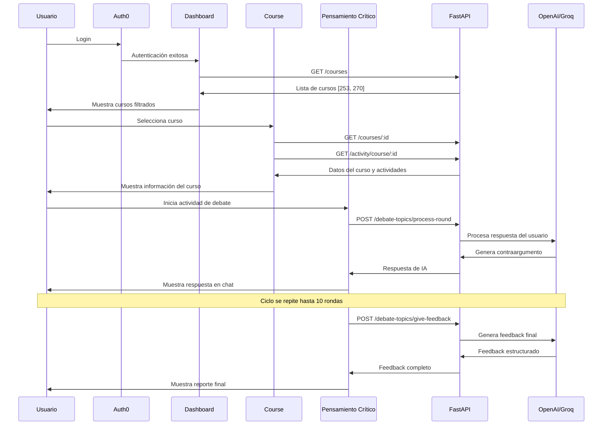
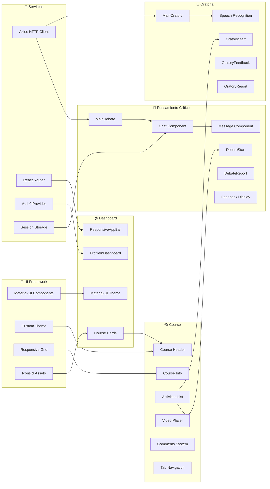
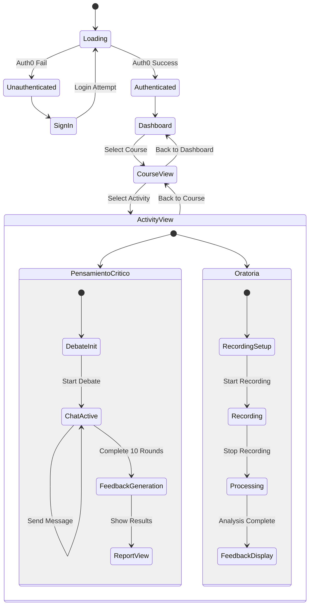

# Diagrama de Arquitectura Frontend - Código Mermaid

## Diagrama Principal de Arquitectura

```mermaid
graph TB
    %% Capa de Usuario
    User[👤 Usuario] --> Auth[🔐 Autenticación]
    
    %% Capa de Enrutamiento
    Auth --> App[📱 App.js - Router Principal]
    
    %% Rutas principales
    App --> SignIn[🔑 SignIn]
    App --> SignUp[📝 SignUp]
    App --> Dashboard[🏠 Dashboard]
    App --> Course[📚 Course]
    App --> Activity[📋 Activity]
    
    %% Dashboard
    Dashboard --> NavBar[🧭 ResponsiveAppBar]
    Dashboard --> Profile[👤 ProfileInDashboard]
    Dashboard --> CourseGrid[🎯 Course Cards Grid]
    
    %% Course Component
    Course --> CourseNav[🧭 ResponsiveAppBar]
    Course --> CourseHeader[🖼️ Header con imagen]
    Course --> CourseMain[📄 Información principal]
    Course --> CourseSide[📺 Video y navegación]
    Course --> Comments[💬 Sistema de comentarios]
    
    %% Actividades Personalizadas
    Activity --> PensamientoCritico[🧠 Pensamiento Crítico]
    Activity --> Oratoria[🎤 Oratoria]
    Activity --> OtrasActividades[📚 Otras Actividades]
    
    %% Módulo Pensamiento Crítico
    PensamientoCritico --> DebateStart[🚀 DebateStart]
    PensamientoCritico --> MainDebate[💭 MainDebate]
    PensamientoCritico --> DebateReport[📊 DebateReport]
    MainDebate --> Chat[💬 Chat Component]
    Chat --> Message[📝 Message Component]
    
    %% Módulo Oratoria
    Oratoria --> OratoryStart[🚀 OratoryStart]
    Oratoria --> MainOratory[🎤 MainOratory]
    Oratoria --> OratoryFeedback[📈 OratoryFeedback]
    Oratoria --> OratoryReport[📊 OratoryReport]
    
    %% Servicios y APIs
    Chat --> FastAPI[🔗 FastAPI Backend]
    OratoryFeedback --> SpeechAPI[🎙️ Speech Recognition API]
    FastAPI --> OpenAI[🤖 OpenAI GPT-4o-mini]
    FastAPI --> Groq[🦙 Groq Llama-3.3-70b]
    
    %% Estado y Persistencia
    Dashboard --> ReactHooks[⚛️ React Hooks]
    Course --> SessionStorage[💾 Session Storage]
    Auth --> Auth0[🔐 Auth0 Service]
    
    %% Styling y UI
    Dashboard --> MaterialUI[🎨 Material-UI v5]
    Course --> ThemeProvider[🎭 Theme Provider]
    
    %% Clases de estilo
    classDef userLayer fill:#e1f5fe
    classDef routingLayer fill:#f3e5f5
    classDef componentLayer fill:#e8f5e8
    classDef serviceLayer fill:#fff3e0
    classDef dataLayer fill:#fce4ec
    
    class User userLayer
    class Auth,App routingLayer
    class SignIn,SignUp,Dashboard,Course,Activity,PensamientoCritico,Oratoria componentLayer
    class FastAPI,OpenAI,Groq,SpeechAPI serviceLayer
    class ReactHooks,SessionStorage,Auth0 dataLayer
```



## Diagrama de Flujo de Datos



## Diagrama de Componentes Detallado



## Diagrama de Estados y Hooks



## Uso del Diagrama

### Para incluir en LaTeX:
1. Copia el código Mermaid
2. Usa un generador online como mermaid.live
3. Exporta como PNG/SVG
4. Incluye en tu documento LaTeX

### Ejemplo de inclusión en LaTeX:
```latex
\begin{figure}[h]
    \centering
    \includegraphics[width=\textwidth]{diagrama-arquitectura-frontend.png}
    \caption{Arquitectura Frontend de la Aplicación de Habilidades Blandas}
    \label{fig:frontend-architecture}
\end{figure}
``` 